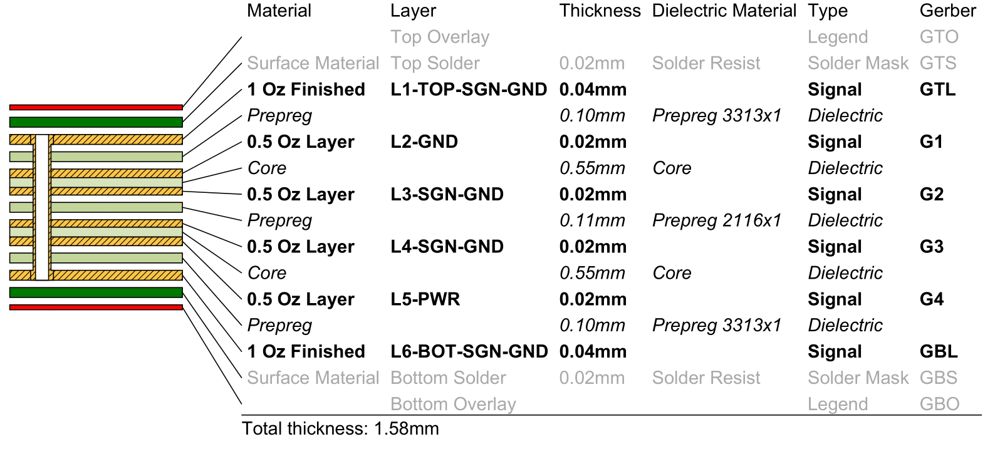
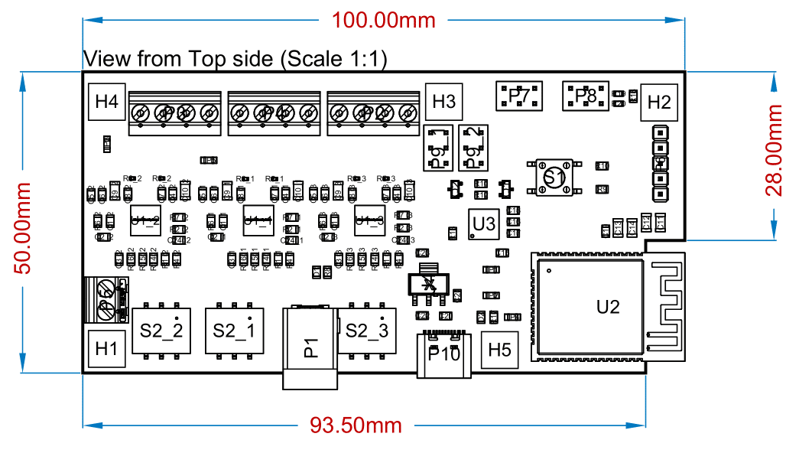

# Lens-Maker PCB

This repository contains the design files for a printed circuit board (PCB) that enables the control of three stepper motors using an A4988 driver and an ESP32-WROOM32E microcontroller module. The PCB provides a compact and convenient solution for incorporating stepper motor control into your projects.


# Table of contents

* [Overview](#overview)
* [Features](#features)
* [Repository Structure](#repository-structure)
* [PCB Design](#pcb-design)
* [Bill of Materials (BOM)](#bill-of-materials)
* [Fabrication Instructions](#fabrication-instructions)
* [Contributing](#contributing)
* [License](#license)

## Overview
>[Table of contents](#table-of-contents)

The purpose of this PCB design is to simplify the process of controlling three stepper motors in your projects. By integrating an A4988 driver and an ESP32-WROOM32E module on a single board, you can easily interface with the motors and leverage the features of the ESP32 for advanced control and communication capabilities. In this design in particular three 2(A) stepper motors where needed to be controlled for a lens maker lathe, and the PCB was designed to fit the casing of the lathe.

# Features
>[Table of contents](#table-of-contents)

* **Compact**: The PCB is designed to be as small as possible while still providing the necessary features for stepper motor control.
* **Integrated A4988 Driver**: The A4988 driver is integrated into the PCB, eliminating the need for a separate driver module.
* **Integrated ESP32-WROOM32E Module**: The ESP32-WROOM32E module is integrated into the PCB, eliminating the need for a separate microcontroller module.
* **Integrated WiFi and Bluetooth Antennas**: The ESP32-WROOM32E module includes integrated WiFi and Bluetooth antennas, eliminating the need for external antennas.
* **Integrated Power Supply**: The PCB includes a 5V power supply that can be used to power the ESP32-WROOM32E module and the A4988 driver.
* **Integrated USB to UART Converter**: The PCB includes a USB to UART converter that can be used to program the ESP32-WROOM32E module and communicate with it via serial.
* **Integrated Reset Button**: The PCB includes a reset button that can be used to reset the ESP32-WROOM32E module.
* **I2C, SPI and GPIO Headers**: The PCB includes headers that can be used to connect I2C, SPI and GPIO devices to the ESP32-WROOM32E module.
* **JTAG Header**: The PCB includes a header that can be used to connect a JTAG debugger to the ESP32-WROOM32E module.
* **USB-C Connector**: The PCB includes a USB-C connector that can be used to power the PCB and communicate with the ESP32-WROOM32E module via USB.

# Repository Structure
>[Table of contents](#table-of-contents)

The repository is organized as follows:

* **`Lens-Maker`**: This directory contains the Altium design files for the PCB.
    * **`Project Outputs for Lens-Maker`**: This directory contains the Output files of the project.
        * **`GerberX2`**: This directory contains the Gerber files of the PCB.
        * **`Lens-Maker_Schematic.PDF`**: This file contains the PDF of the PCB.
        * **`ExportSTEP`**: This directory contains the 3D model of the PCB.
        * **`BOM`**: This directory contains the Bill of Materials of the PCB. 
* **`docs`**: This directory contains the documentation images for the PCB.
* **`LICENSE`**: This file contains the license for the PCB design.
* **`README.md`**: This file contains the documentation for the PCB design.

# PCB Design
>[Table of contents](#table-of-contents)

This PCB was design using Altium Designer 23.4.1. The PCB design files can be found in [here](./Lens-Maker). The PCB was designed to be as small as possible while still providing the necessary features for stepper motor control. The PCB is a 6-layer board with the following stackup:




The PCB was designed to fit the casing of the lens maker lathe, and the dimensions of the PCB are as follows:




## Microcontroller
>[Design](#design)

The design of this PCB starts at the desition of the MCU chosen for this purpose. Because of its simplicity and WiFi and Bluetooth antennas already integrated, an ESP32-WROOM-32E is chosen for this design. The main advantages of choosing this microcontroller are:

* **The form factor**: Its a MCU with WLAN capabilities in a size of a regular MCU.
* **Antennas integrated**: The benefits of using an ESP32 module and not an ESP32 MCU is to have the antennas already routed an integrated.
* **Easy to use**: Its many integration generated that ESP32 is a widely used MCU around the world, and this means there's a lot of information and resources to program this MCU.
* **Versatility**: If there is a future design, a new ESP32 module can be changed and the software will 'just work'.

## Stepper Driver
>[Design](#design)

For the Stepper driver, since this design is a prototype approach for the final goal, an A4988 driver was chosen, because of its previous use on a concept desing using the A4988 module from arduino. For future progress a driver change is needed to drive more heavy power Stepper motors. However this driver has a lot of advantages, its ease of use and simplicity makes it really easy tu use and code it, and its application in its own module has the heritage needed for the circuit to rely on.

## Schematic
>[Table of contents](#table-of-contents)


The Schematic of this PCB can be found in [here](./Lens-Maker/Project%20Outputs%20for%20Lens-Maker/Lens-Maker_Schematic.PDF). And below are some images sumarizing it. 


# Bill of Materials
>[Table of contents](#table-of-contents)

| Manufacturer Part Number | Manufacturer                         | Description                                                               | Quantity | Supplier Part Number | Supplier |
| ------------------------ | ------------------------------------ | ------------------------------------------------------------------------- | -------- | -------------------- | -------- |
| CC0805KRX7R9BB104        | YAGEO                                | SMD Capacitor                                                             | 16       | C49678               | JLCPCB   |
| CL21B224KBFNNNE          | Samsung Electro-Mechanics            | SMD Capacitor                                                             | 3        | C5378                | JLCPCB   |
| CS2012X7R475K350NRE      | Samwha Capacitor                     | SMD Capacitor                                                             | 12       | C560882              | JLCPCB   |
| C3216X5R1E476MTJ00E      | TDK                                  | SMD Capacitor                                                             | 13       | C76659               | JLCPCB   |
| CL21B105KBFNNNE          | Samsung Electro-Mechanics            | SMD Capacitor                                                             | 2        | C28323               | JLCPCB   |
| C2297                    | Hubei KENTO Elec                     | 0805 Light Emitting Diodes (LED) ROHS                                     | 2        | C2297                | JLCPCB   |
|                          |                                      | Hole M3                                                                   | 5        |                      |          |
| DC-005 2.0               | BOOMELE(Boom Precision Elec)         | Shrouded DC Power Receptacle 2mm 6.4mm Plugin AC/DC Power Connectors ROHS | 1        | C16214               | JLCPCB   |
| 1727036                  | Phoenix Contact                      | TERM BLK 4P SIDE ENT 3.81MM PCB                                           | 3        | C457200              | JLCPCB   |
| 1727010                  | Phoenix Contact                      | TERM BLK 2P SIDE ENT 3.81MM PCB                                           | 1        | C89123               | JLCPCB   |
| PZ254V-11-05P            | XFCN                                 |                                                                           | 1        | C492404              | JLCPCB   |
| C65114                   | BOOMELE(Boom Precision Elec)         | Straight 2 6 2.54mm Black Straight,P=2.54mm  Pin Headers ROHS             | 4        | C65114               | JLCPCB   |
| TYPE-C-31-M-12           | Korean Hroparts Elec                 | USB C SMD Connector                                                       | 1        | C165948              | JLCPCB   |
| S8050                    | JSMSEMI                              |                                                                           | 2        | C916390              | JLCPCB   |
| 0805W8F1002T5E           | UNI-ROYAL(Uniroyal Elec)             | SMD Resistor                                                              | 12       | C17414               | JLCPCB   |
| 0805W8F0000T5E           | UNI-ROYAL(Uniroyal Elec)             | SMD Resistor                                                              | 4        | C17477               | JLCPCB   |
| ERJ2BWFR050X             | PANASONIC                            | SMD Resistor                                                              | 6        | C412880              | JLCPCB   |
| RS-05K104JT              | FH (Guangdong Fenghua Advanced Tech) | SMD Resistor                                                              | 9        | C118844              | JLCPCB   |
| AECR0805F1K60K9          | Resistor.Today                       | SMD Resistor                                                              | 1        | C352253              | JLCPCB   |
| CR0805J80123G            | LIZ Elec                             | SMD Resistor                                                              | 3        | C101937              | JLCPCB   |
| 0805W8F4700T5E           | UNI-ROYAL(Uniroyal Elec)             | SMD Resistor                                                              | 1        | C17710               | JLCPCB   |
| 0805W8F3300T5E           | UNI-ROYAL(Uniroyal Elec)             | SMD Resistor                                                              | 1        | C17630               | JLCPCB   |
| RM10FTN5104              | TA-I Tech                            | SMD Resistor                                                              | 1        | C156163              | JLCPCB   |
| ERJ3EKF2201V             | PANASONIC                            | SMD Resistor                                                              | 2        | C116387              | JLCPCB   |
| PTS645SM43SMTR92LFS      | C&K                                  | SWITCH TACTILE SPST-NO 0.05A 12V                                          | 1        | C221880              | JLCPCB   |
| SDA03H0SBR               | C&K                                  | SWITCH SLIDE DIP SPST 25MA 24V                                            | 3        | C221950              | JLCPCB   |
| RH-5015                  | Ronghe                               | Thimble/Copper Rod/Test Ring ROHS                                         | 5        | C5199798             | JLCPCB   |
| A4988SETTR-T             | Allegro MicroSystems, LLC            | IC MTR DRVR BIPOLAR 3-5.5V 28QFN                                          | 3        | C38437               | JLCPCB   |
| ESP32-WROOM-32E-N4       | Espressif Systems                    | RX TXRX MOD WIFI TRACE ANT SMD                                            | 1        | C701341              | JLCPCB   |
| CP2102N-A02-GQFN28R      | SILICON LABS                         | QFN-28 USB ICs ROHS                                                       | 1        | C964632              | JLCPCB   |
| AMS1117-3.3V             | Shenzhen Fuman Elec                  | IC-1117 V.reg. 1A 3V3 SOT223 SMD Ams                                      | 1        | C173386              | JLCPCB   |


# Fabrication Instructions
>[Table of contents](#table-of-contents)


The fabrication instructions can be found in [here](./Lens-Maker/Project%20Outputs%20for%20Lens-Maker/Lens-Maker_Fabrication_Instructions.PDF) and the Gerber files are located in [this directory](./Lens-Maker/Project%20Outputs%20for%20Lens-Maker/GerberX2/). For the PCBA the assembly drawing can be found [here](./Lens-Maker/Project%20Outputs%20for%20Lens-Maker/Lens-Maker_Assembly_Drawings.PDF).


## 3D Model
>[Table of contents](#table-of-contents)


A 3D model of the PCB is available for the design and manufacture of the lathe casing located in [here](./Lens-Maker/Project%20Outputs%20for%20Lens-Maker/ExportSTEP/Lens-Maker_3D_STEP.step).

## Some pictures
>[Table of contents](#table-of-contents)


# Contributing
>[Table of contents](#table-of-contents)

Please do not hesitate to reach out to me if you find any issue with the code or if you have any questions.

* Personal email: [ianczdiaz@gmail.com](mailto:ianczdiaz@gmail.com)

* LinkedIn Profile: [https://www.linkedin.com/in/iancraz/](https://www.linkedin.com/in/iancraz/)

# License
>[Table of contents](#table-of-contents)

```
MIT License

Copyright (c) 2023 Ian Cruz Diaz

Permission is hereby granted, free of charge, to any person obtaining a copy
of this software and associated documentation files (the "Software"), to deal
in the Software without restriction, including without limitation the rights
to use, copy, modify, merge, publish, distribute, sublicense, and/or sell
copies of the Software, and to permit persons to whom the Software is
furnished to do so, subject to the following conditions:

The above copyright notice and this permission notice shall be included in all
copies or substantial portions of the Software.

THE SOFTWARE IS PROVIDED "AS IS", WITHOUT WARRANTY OF ANY KIND, EXPRESS OR
IMPLIED, INCLUDING BUT NOT LIMITED TO THE WARRANTIES OF MERCHANTABILITY,
FITNESS FOR A PARTICULAR PURPOSE AND NONINFRINGEMENT. IN NO EVENT SHALL THE
AUTHORS OR COPYRIGHT HOLDERS BE LIABLE FOR ANY CLAIM, DAMAGES OR OTHER
LIABILITY, WHETHER IN AN ACTION OF CONTRACT, TORT OR OTHERWISE, ARISING FROM,
OUT OF OR IN CONNECTION WITH THE SOFTWARE OR THE USE OR OTHER DEALINGS IN THE
SOFTWARE.
```
