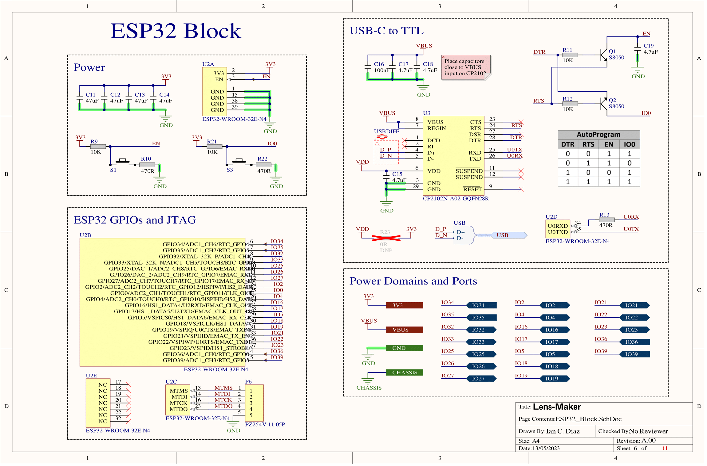

# Lens-Maker PCB

The objective of this project is to control three 2(A) stepper motors accordingly to control a contact lens manufacturing lathe. The controller must have Bluetooth and WiFi capabilities and available GPIOs for debugging purposes.


# Table of contents

* [Schematic](#schematic)
* [Fabrication Instructions](#fabrication-instructions)
* [3D Model](#3d-model)
* [Some Pictures](#some-pictures)
* [Contact](#contact)

## Schematic
>[Table of contents](#table-of-contents)


The Schematic of this PCB can be found in [here](./Lens-Maker/Project%20Outputs%20for%20Lens-Maker/Lens-Maker_Schematic.PDF). And below are some images sumarizing it. 





## Fabrication Instructions
>[Table of contents](#table-of-contents)


The fabrication instructions can be found in [here](./Lens-Maker/Project%20Outputs%20for%20Lens-Maker/Lens-Maker_Fabrication_Instructions.PDF) and the Gerber files are located in [this directory](./Lens-Maker/Project%20Outputs%20for%20Lens-Maker/GerberX2/). For the PCBA the assembly drawing can be found [here](./Lens-Maker/Project%20Outputs%20for%20Lens-Maker/Lens-Maker_Assembly_Drawings.PDF).


## 3D Model
>[Table of contents](#table-of-contents)


A 3D model of the PCB is available for the design and manufacture of the lathe casing located in [here](./Lens-Maker/Project%20Outputs%20for%20Lens-Maker/ExportSTEP/Lens-Maker_3D_STEP.step).

## Some pictures
>[Table of contents](#table-of-contents)


# Contact
>[Table of contents](#table-of-contents)

Please do not hesitate to reach out to me if you find any issue with the code or if you have any questions.

* Personal email: [idiaz@itba.edu.ar](mailto:idiaz@itba.edu.ar)

* LinkedIn Profile: [https://www.linkedin.com/in/iancraz/](https://www.linkedin.com/in/iancraz/)

# License
>[Table of contents](#table-of-contents)

```
MIT License

Copyright (c) 2023 Ian Cruz Diaz

Permission is hereby granted, free of charge, to any person obtaining a copy
of this software and associated documentation files (the "Software"), to deal
in the Software without restriction, including without limitation the rights
to use, copy, modify, merge, publish, distribute, sublicense, and/or sell
copies of the Software, and to permit persons to whom the Software is
furnished to do so, subject to the following conditions:

The above copyright notice and this permission notice shall be included in all
copies or substantial portions of the Software.

THE SOFTWARE IS PROVIDED "AS IS", WITHOUT WARRANTY OF ANY KIND, EXPRESS OR
IMPLIED, INCLUDING BUT NOT LIMITED TO THE WARRANTIES OF MERCHANTABILITY,
FITNESS FOR A PARTICULAR PURPOSE AND NONINFRINGEMENT. IN NO EVENT SHALL THE
AUTHORS OR COPYRIGHT HOLDERS BE LIABLE FOR ANY CLAIM, DAMAGES OR OTHER
LIABILITY, WHETHER IN AN ACTION OF CONTRACT, TORT OR OTHERWISE, ARISING FROM,
OUT OF OR IN CONNECTION WITH THE SOFTWARE OR THE USE OR OTHER DEALINGS IN THE
SOFTWARE.
```
